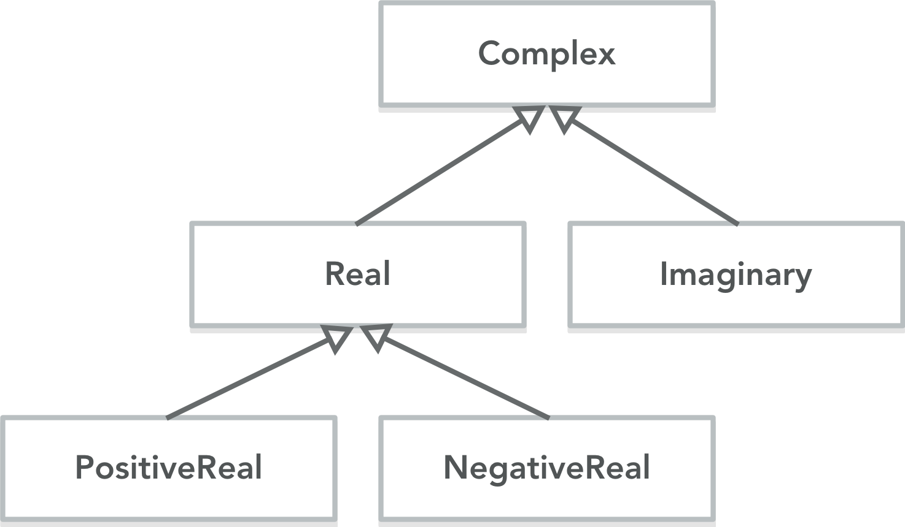
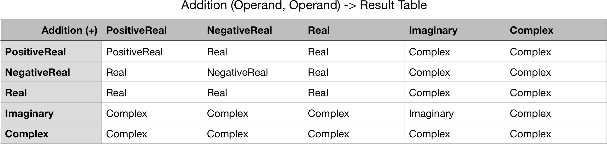

MathTypes
===========

Swift current lacks numeric types appropriate for scientific programming. This document provides an overview of the design requirements for scientific programming, as well as one possible implementation.

Design Requirements
===================

This set of design requirements arose out of earlier discussions on the Swift forums about [complex numbers](https://forums.swift.org/t/complex-numbers/11929) and [integer division](https://forums.swift.org/t/default-type-inference-of-integers/11914), as well as existing practices used by the scientific community with Python, Matlab, and Julia. There may be other requirements, and, if so, please discuss.

## 1. Do not interfere with the existing behavior of Standard Library types

As raised in both this context and in this context, there is very strong resistance to changing the behavior of the existing types in the Swift Standard Library.

## 2. Sensible mixed precision promotion and demotion rules

There are a number of choices that have to be made with regards to how Swift handles binary operations with mixed precision types. The types in the Swift Standard Library (such as Int and Float) are closed under all operations, which is not the expected behavior in scientific programming (but may be in other contexts, hence design requirement #1).

1. An integer divided by an integer should go to a floating point type. This was raised in the Swift forums [here](https://forums.swift.org/t/default-type-inference-of-integers/11914), and it is clear it must be implemented in some form to create a viable scientific programming environment. One could also consider introducing a rational type.
2. Mixed floating point precision operations should represent the result with the *lowest* precision type. For example, a single plus a double should result in a single. There are really three possible choices here: 1) throw an error, 2) promote to the higher precision type (like Julia) or 3) demote to the lower precision type (like Matlab). Option 2 is obviously wrong, since you've now introduced garbage into the value type. Option 1 is dangerous, because although it forces the programmer to make a decision, it will rarely be the case that promoting the single precision to a double precision is the right thing to do. Thus, it makes the most sense to automatically demote precision.

## 3. Avoid unnecessary algebriac type promotion

As discussed in the [Swift forums](https://forums.swift.org/t/complex-numbers/11929/83?u=jeffreyearly) and [summarized here](https://gist.github.com/JeffreyEarly/da5b2e4659136cbbdc00655815dd0d1b), one should avoid unnecessary floating point operations and memory requirements when possible. For example, this means avoiding situations where you need to cast a real number as a complex number in order to multiply by an imaginary number. This loses type information, requires more memory, and requires more floating point operations.

Another useful example of unnecessary type promotion is taking the square root of a real number. Because the real number might be negative or positive, in general you have to assume the result is a complex number. However, if you are able to identify the real number as being either positive or negative, you know the result will be either a positive real or an imaginary number.

## 4. Work well with existing libraries

As much as possible, Swift Math types should try to work well with existing math types in other programming environments. This means embrancing floating point math, but also working with [standard complex number data structures](https://forums.swift.org/t/complex-numbers/11929/84).

Implementation
===================

In order to address design requirement #1, this math type library does not define any operations on existing Swift Standard library types. The MathTypes library uses ```Int```, ```Float```, ```Double```, etc only as a *storage* for a new set of types. This allows the implementation of design requirement #2 (mixed precision operations) without interfering with any existing Swift code.

The inheritance structure of the basic algebriac types is shown in the following figure,

where it is to be understood that the number 0 is included in both the positive and negative partitioning of the real number line.

Because Swift is statically typed, avoiding unnecessary algebriac type promotion in Swift *requires* encoding the above algebriac structure of the different types. For example, addition binary operator has the following structure,



which must be somehow encoded into Swift.

Friction
=======

1. Arrays --- Concatenation of MathTypes into an array should probably follow the precision promotion/demotion rules as well as the algebriac type promotion rules. Array literals may need to be changed to make this work.
2. Signed literals --- integer and floating point literals will need to be able to mapped to the PositiveReal and NegativeReal types.
3. The number zero --- The number zero is technically a part of all of the algebriac structures (its unique in this way), so we need to be careful that it's handled sensibly.
4. Integer division floating point precision --- When dividing two integers, what precision floating point should it result in? Double? Single? Something else? Choosing the highest precision possible will work correctly with the precision promotion/demotion rules, but it can also result in wasted FLOPs, which is not a good thing.
